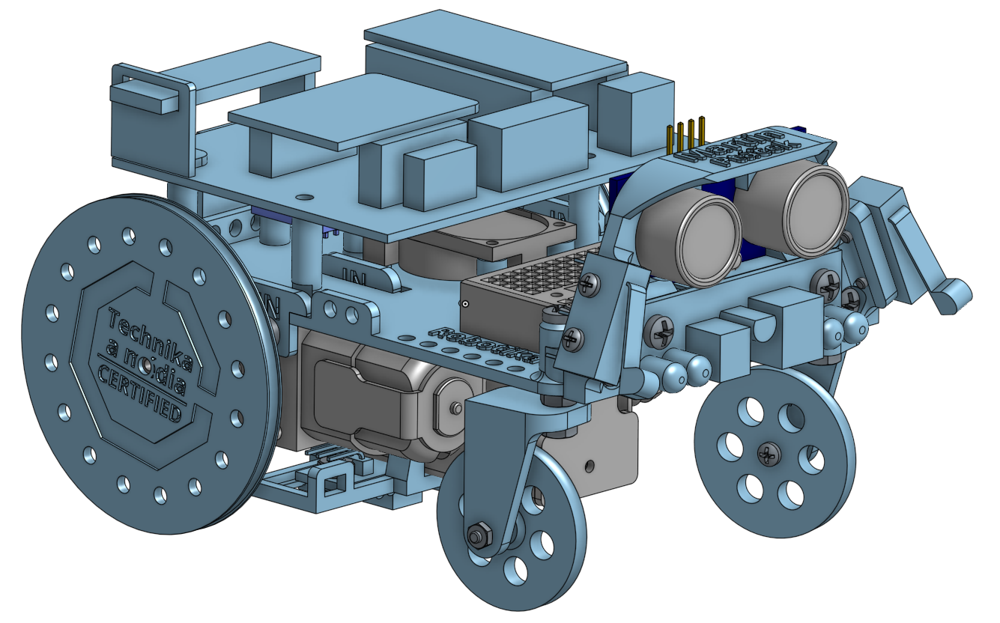

# Multifunkční robotická platforma RoboTommy
RoboTommy je open source projekt zamýšlený jako univerzální platforma pro začátečníky v robotice, elektronice a programování. Při návrhu byl kladen důraz na široké možnosti robota v kombinaci s nízkými nároky na kutila.

RoboTommy byl vytvořen jako projekt pro robotické lekce a letní tábory v SVČ Lužánky v Brně. Autory jsou Martin Ptáček, Petr Vávra, Martin Coufal a Marek Coufal.

Robotická platforma je založena na 3D tištěném šasi se dvěma DC motory řízenými H můstkem. Jako řídicí jednotka byla použita kombinace mikrokontrolérů Arduino Nano Atmega328 a Wemos D1 Mini ESP8266.

Pro přidání vlastních functionalit nebo upravení designu se přihlašte na onshape.com a vyhledejte si projekt "RoboTommy". Pro zobrazení elektronických schémat nebo upravení základní desky, navštivte [easyeda.com](https://easyeda.com/technika/Arduino_Nano_ESP_MPU_board-965e335938244bc3aa54cd378a177850).

## Licence

* Obsah tohoto repozitáře mimo složku *Software* je sdílen pod licencí [Attribution-NonCommercial-ShareAlike 4.0 International (CC BY-NC-SA 4.0)](https://creativecommons.org/licenses/by-nc-sa/4.0/).

* Obsah složky *Software* je sdílen pod licencí [GNU Lesser General Public License v3.0](https://www.gnu.org/licenses/lgpl-3.0.en.html).

# Multifunctional robotics platform RoboTommy [en]
RoboTommy is an open source project devoted to be a universal platform 
for robotics, electronics and programming beginners. In construction 
emphasis was placed on broad capabilities of the robot in combination 
with low demands on the tinkerer.

RoboTommy was created as a support tool for robotics classes and summer 
camps in SVC Luzanky in Brno by Martin Ptacek, Petr Vavra, Martin Coufal and Marek Coufal.

This robotics platform is based upon a 3D printed differential chassis with two 
DC engines controlled by a H bridge. For control purposes a combination of 
Aruino Nano Atmega328 and Wemos D1 Mini ESP8266 microcontrollers is used.

To add custom mechanical features or edit RoboTommy please visit onshape.com, log in and search for the "RoboTommy" project. To check the electronical schematics and control the MainBoard layout, please visit [easyeda.com](https://easyeda.com/technika/Arduino_Nano_ESP_MPU_board-965e335938244bc3aa54cd378a177850).

## License
* The contents of this repository excluding folder *Software* is shared under license [Attribution-NonCommercial-ShareAlike 4.0 International (CC BY-NC-SA 4.0)](https://creativecommons.org/licenses/by-nc-sa/4.0/).
* The contents of the folder *Software* is shared under license [GNU Lesser General Public License v3.0](https://www.gnu.org/licenses/lgpl-3.0.en.html).

1.  
