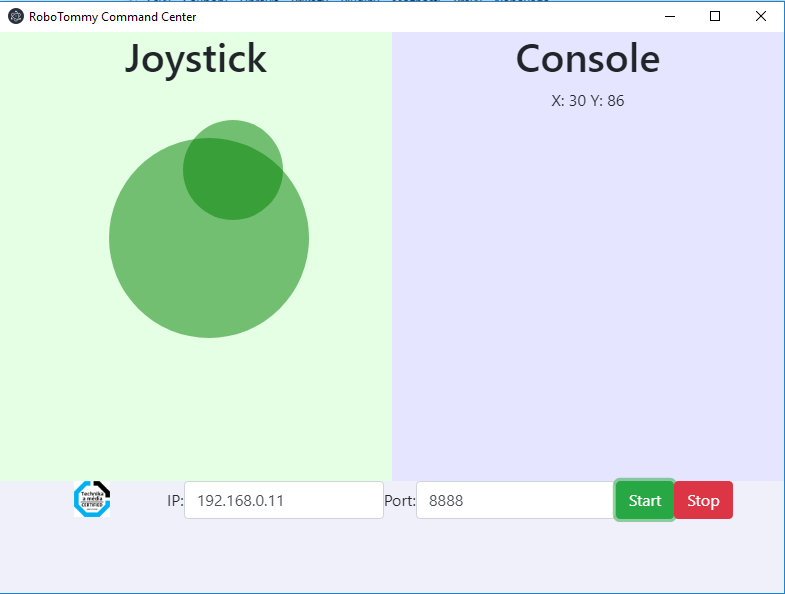

# Návod na programování RoboTommy - dálkové ovládání

V tomto návodě je popsána instalace vývojového prostředí, nahrání připravených programů z letního tábora a také zprovoznění samotného dálkového ovládání platformy RoboTommy. Pro dálkové ovldání je Robotommy připojen ke stejné WiFi síti jako PC s ovládacím programem.

Pro programování RoboTommy je použito vývojové prostředí Visual Studio Code s rozšířením PlatformIO. Pro instalaci prostředí a rozšíření můžete použít tento [návod](https://docs.platformio.org/en/latest/ide/vscode.html#installation), jehož hlavní část je na obrázku níže:

<figure>
    
    <figcaption></figcaption>
</figure>

## Arduino Nano ATmega328
Nejdříve naprogramujeme koncový mikrokontrolér Arduino Nano. Projekt programu otevřeme v VS Code pomocí File->Open Folder->Zvolíme cestu "RoboTommy\Software\Chotěborky_2018_Remote_Control\Arduino". Tento program je možné bez úprav nahrát do RoboTommy. Arduino Nano zasunuté do MainBoardu připojíme k PC pomocí USB Mini B kabelu. V případě použití neoriginálního Arduino klona je třeba nainstalovat [driver CH340](https://sparks.gogo.co.nz/ch340.html). Dobrou praxí je ujistit se, že je Arduino detekováno ve Windows Správci zařízení. 

V levém spodním rohu VS Code se nachází panel PlatformIO. Je zde i tlačítko pro kompilaci a nahrání programu do Arduina (šipka směřující vpravo). Lze použít i klávesovou zkratku CTRL+ALT+U. V případě, že je připojeno více USB zařízení, budete ve spodním terminálu vyzvání k napsání názvu portu, pod kterým je Arduino vedeno, např. "COM11". Úspěšné nahrání programu je značeno velkým nápisem "SUCESS" na spodním terminálu.

## ESP8266 WEMOS D1 mini
Obdobným způsobem otevřeme projekt programu pro WiFi modul ESP8266: File->Open Folder->Zvolíme cestu "RoboTommy\Software\Chotěborky_2018_Remote_Control\ESP". V tomto projektu je třeba změnit přihlašovací údaje lokální WiFi sítě. K tomu otevřeme soubor "WifiHandler.h" a přepíšeme údaj v uvozovkách "Your_SSID" na jméno lokální WiFi sítě a "Your_password" na její heslo. Uvozovky je nutné zachovat:

<figure>
    
    <figcaption></figcaption>
</figure>

Pomocí CTRL+ALT+U nahrajeme program do ESP8266 připojeného k PC pomocí micro USB kabelu. Po nahrání programu signalizovaného nápisem "SUCCESSL je vhodné ES8266 resetovat pomocí bočního tlačítka na WEMOS modulu (nalevo od nápisu RESET). Poté by měla OLED obrazovka zobrazit úvodní loga, následně název WiFi sítě, ke které se připojuje a po úspěšném připojení obdrženou IP adresu, pomocí které je možné RoboTommy rozeznat od dalších zařízení na síti.

## Ovládací program Command center
Start ovládacího programu pro Windows provedete spuštěním souboru "RoboTommy\Software\Chotěborky_2018_Remote_Control\RoboTommy Command Center-win32-x64/RoboTommy Command Center.exe". V nově otevřeném okně zadáte IP adresu RoboTommy, která je na něm zobrazena na OLED obrazovce.  Po kliknutí na tlačítko "Start" je možné ovládat pohyb RoboTommy pomocí kniplu, který se zobrazí držením levého tlačítka myši uvnitř okna Command Center. 

<figure>
    
    <figcaption></figcaption>
</figure>
