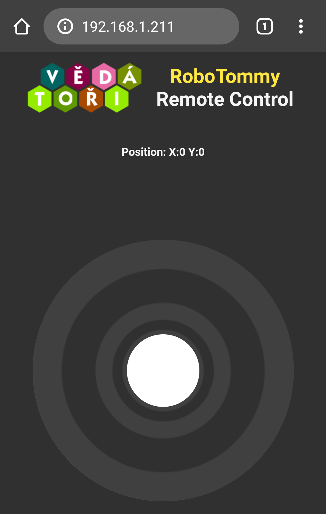

# Návod na programování RoboTommy - dálkové ovládání

V tomto návodě je popsána instalace vývojového prostředí, stažení tohoto repozitáře, nahrání připravených programů a také zprovoznění samotného dálkového ovládání platformy RoboTommy. Pro dálkové ovládání je Robotommy připojen ke stejné WiFi síti jako chytré zařízení sloužící jako ovladač.

Pro programování RoboTommy je použito vývojové prostředí [Visual Studio Code](https://code.visualstudio.com/download) s rozšířením PlatformIO. Pro instalaci prostředí a rozšíření můžeme použít tento [návod](https://docs.platformio.org/en/latest/ide/vscode.html#installation), jehož hlavní část je na obrázku níže:

<figure>
    
    <figcaption></figcaption>
</figure>

Pro naprogramování RoboTommy je třeba tento repozitář umístit do souborového systému vašeho PC a to buď stažením nebo naklonováním:
* Stažení pomocí kliku na tlačítko "Clone or download" vpravo na [hlavní stránce repozitáře](https://github.com/MarPta/RoboTommy) a následně "Download ZIP". Toto je jednodušší cesta pro začátečníky.
* Nakolonování pomocí [GIT](https://git-scm.com/downloads) a libovolného GIT klienta (GitHub Desktop, SourceTree).

## Arduino Nano ATmega328
Nejdříve naprogramujeme mikrokontrolér Arduino Nano. Projekt programu otevřeme v VS Code pomocí File->Open Folder->Zvolíme cestu "RoboTommy\Software\ArduinoNano". Tento program je možné bez úprav nahrát do RoboTommy. Arduino Nano zasunuté do MainBoard připojíme k PC pomocí USB Mini B kabelu. V případě použití neoriginálního Arduino klonu je třeba nainstalovat [driver CH340](https://sparks.gogo.co.nz/ch340.html). Dobrou praxí je ujistit se, že je Arduino detekováno v systémovém Správci zařízení. 

V levém spodním rohu VS Code se nachází panel PlatformIO. Je zde i tlačítko pro kompilaci a nahrání programu do Arduina (šipka směřující vpravo). Lze použít i klávesovou zkratku CTRL+ALT+U. V případě, že je připojeno více USB zařízení, budete ve spodním terminálu vyzvání k napsání názvu portu, pod kterým je Arduino vedeno, např. "COM11". Úspěšné nahrání programu je značeno velkým nápisem "SUCCESS" na spodním terminálu.

## ESP8266 WEMOS D1 mini
Mikrokontrolér ESP8266 budeme programovat na dvakrát. První program "ESP8266_test_calibration" slouží ke kalibraci gyroskopu a až řídicí program "ESP8266_webControl" umožňuje ovládání robota. 

Otevřeme projekt programu pro kalibraci RoboTommy z VS Code: File->Open Folder->Zvolíme cestu "RoboTommy\Software\ESP8266_test_calibration". Před nahráním programu do ESP8266 umístíme RoboTommy na vodorovnou podložku. Pomocí CTRL+ALT+U nahrajeme program do ESP8266 připojeného k PC pomocí micro USB kabelu. Po nahrání programu signalizovaného nápisem "SUCCESS" je vhodné ES8266 resetovat pomocí bočního tlačítka na WEMOS modulu (vedle nápisu RESET). Po restartu je na OLED obrazovce vypsáno, zda bylo úspěšné připojení gyroskopu MPU. V případě neúspěšného připojení odpoj a zapoj napájení (USB). Po úspěšném připojení MPU je spuštěna kalibrace, což je signalizováno nápisem "Calibration running". Nyní nesmíme s RoboTommy pohnout. Během jedné minuty se kalibrace dokončí s hláškou "Calibration done". Kalibrační data jsou uložena v paměti EEPROM (Electrically Erasable Programmable Read-Only Memory) a budou přečtena následujícím řídicím programem.

Otevřeme projekt programu pro řízení RoboTommy: File->Open Folder->Zvolíme cestu "RoboTommy\Software\ESP8266_webControl" a nahrajeme do ESP. Po restartu zobrazí úvodní obrazovka na OLED a vybídne nás k připojení k WiFi "RoboTommy". Použij libovolné chytré WiFi zařízení (mobil, tablet, PC) a najdi pomocí něj WiFi "RoboTommy". U novějších zařízení budeš následně vybídnut k přihlášení se do sítě, to udělej. U starších je třeba otevřít prohlížeč a zadat libovolnou URL (např. "osel.cz"). Následně se zobrazí konfigurační portál, ve kterém vybereš lokální (např. domácí) WiFi síť a zadáš její heslo. Po úspěšném připojení k lokální WiFi síti zobrazí RoboTommy svou přidělenou IP adresu na obrazovce.

Kromě samotného programu, který poběží na ESP8266, je do něj třeba také nahrát kód webové stránky, která se zobrazí a poběží v ovládacím zařízení. Ve VS Code necháme otevřený projekt "ESP8266_webControl" a spustíme PlatformIO terminál. Ten se spouští pomocí lišty nástrojů PlatformIO vlevo dole, kliknutím na tlačítko nejvíce v pravo s vyskakujícím popiskem "PlatformIO: New Terminal". Do Terminálu zadáme příkaz 
```
pio run -t uploadfs
```
 a potvrdíme klávesou enter. Počkáme dokud se proces nahrávání neukončí velkým nápisem "SUCCESS". Nyní můžeme ESP8266 odpojit od PC.

## Dálkové ovládání
Pro dálkové ovládání RoboTommy je možné opět použít libovolné chytré WiFi zařízení. S ním se připojíme na lokální WiFi, ke které je již RoboTommy připojen. Otevřeme internetový prohlížeč a do políčka pro URL adresu zadáme adresu IP, kterou nám RoboTommy ukazuje na své obrazovce, např. "192.168.1.211". Načte se nám webová stránka s joystickem ve spodní části. Pomocí něj řídíme RoboTommy. 

<figure>
    
    <figcaption></figcaption>
</figure>