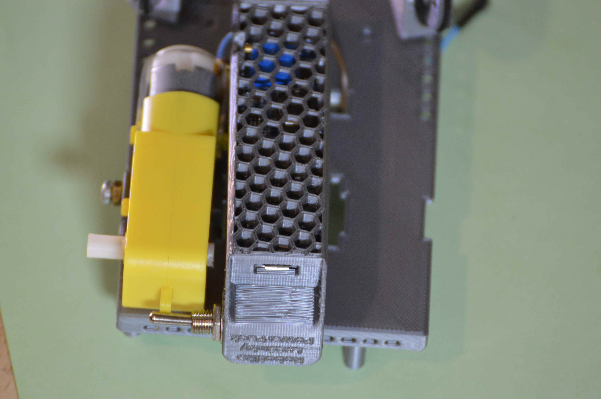

# Montáž minimální konfigurace RoboTommy

*TODO: Doplnit rozměry šroubů, názvy korespodujících stl součástí, názvy elektronických součástí + whereToBuy*
## Součásti

1. **2x kolo, gumička, šroubek**
    
2. **1x Main Board**

    *povinné součásti pro funkčnost*
    1. svorky napájení 
    2. svorky motorů
    3. připájený DRV 8833 Motor Driver
    4. dutinkové lišty pro Arduino Nano + Arduino Nano
    5. 3x šrouby pro připevnění na nosnou desku
   
    *volitelné součásti*
    1. Senzor vlhkosti a teploty DHT12
    2. dutinkové lišty pro Wemos D1 MINI + Zenerovy diody a odpory + Wemos D1 MINI
    3. dutinkové lišty pro gyroskop (napájené zespodu) + gyroskop
    4. Gesture senzor
    5. OLED displej 128x32

       
    
3. **1x nosná deska s nepájivým polem**
    
4. **1x Power Pack** 
    
5. **2x motor, 4x úchyt, 2x uchycovací šroub a matka**
    
6. **2x závěs předního kola, 2x kolo, 2x uchycovací šroub, 4x matka, 2x gumička, 2x uchycovací šroub, 4x matka**
    

## Proces montáže

### Montáž závěsu předního kola

Pro tuto část je třeba součásti z bodů 6 a 1 části Součásti tohoto dokumentu.

<<<<<<< HEAD
1. Navléct gumičku na kolo, provléct šroub kolem, z druhé strany našroubovat matku. *Matka nebude v kontaktu s kolem, je nutné zachovat malou mezeru.*
    
=======
1. Navléct gumičku, provléct šroub kolem, z druhé strany našroubovat matku. *Matka nebude v kontaktu s kolem, je nutné zachovat malou mezeru.*
    
>>>>>>> fd59f11337bc10f44106d7633502139bb4ab0da0
2. Konec šroubu provléct závěsem a na konci přišroubovat matku. *Obě matky budou dotaženy ve směru šipek na obrázku, směrem k závěsu kola, kolo by se mělo volně protáčet.*
    
3. Nosnou deskou protáhnout šroub, přšroubovat na něj matku. *Matka nebude v kontaktu s deskou, je nutné zachovat malou mezeru. Šroub se musí v desce volně protáčet.*
<<<<<<< HEAD
    
4. Za matku navléct na šroub závěs kola a dotáhnout matky, aby byly v kontaktu pouze se závěsem a šroub se mohl v nosné desce volně protáčet.
    
=======
    
4. Za matku navláct na šroub závěs kola a dotáhnout matky, aby byly v kontaktu pouze se závěsema a šroub se mohl v nosné desce volně protáčet.
    
>>>>>>> fd59f11337bc10f44106d7633502139bb4ab0da0
5. **Postup opakovat pro druhé přední kolo.**
    

### Montáž motorů, zadních kol a Power Packu

<<<<<<< HEAD
1. Nosnou desku nasměrovat trubičkami pro uchycení šroubů k zemi. 
2. Na šroub namontovat matku a jeden úchyt, tuto sestavu umístit do odpovídajícho výřezu na nosné desce. Šroub protáhnout skrze motor. *Vodič, který je na motoru nyní blíže k nosné desce, označit páskou.*  Z motoru odvést vodiče skrze přilehlou díru na druhou stranu nosné desky. 
    
    
    
3. Do příslušného výřezu na desce umístit druhý úchyt a přidržovat jej ve správné poloze. Postupným otáčením šroubu přitáhnout druhý úchyt do správné pozice, úchyt při šoubování pevně držet ve vodorovné pozici.
    
    
4. Na konec šroubu nasunout Power Pack. Vodiče Power Packu odvést na druhou stranu nosné desky, každý jendou bližší dírou.
    
5. Pro připevnění druhého motoru opakujte postup v krocích 1 a 2.
    
6. Na obě zadní kola navléct gumičku.
    
7. Na každý z motorů nasunout zadní kolo a přišroubovat šroubkem.
    
8. Postavit RoboTommy na kola.
    
=======
1. Nosnou desku nasměrovat trubičkami pro uchycení šroubů k zemi. Na šroub namontovat matku a jeden úchyt, tuto sestavu umístit do odpovídajícho výřezu na nosné desce. Šroub protnout skrze motor. Z motoru odvést vodiče skrze přilehlou díru na druhou stranu desky. *Vodič, který je na motoru nyní blíže k nosné desce, označit páskou.* 
    
    
    
2. Do příslušného výřezu na desce umístit druhý úchyt a přidržovat jej ve správné poloze. Postupným otáčením šroubu přitáhnout druhý úchyt do správné pozice, úchyt při šoubování pevně držet ve vodorovné pozici.
    
    
3. Na konec šroubu nasunout Power Pack. Vodiče Power Packu odvést na druhou stranu nosné desky, každý jendou bližší dírou.
    
4. Pro připevnění druhého motoru opakujte postup v krocích 1 a 2.
    
5. Na obě zadní kola navléct gumičku.
    
6. Na každý z motorů nasunout zadní kolo a přišroubovat šroubkem.
    
7. Postavit RoboTommy na kola.
    
>>>>>>> fd59f11337bc10f44106d7633502139bb4ab0da0

### Montáž Main Board

Následující část předpokládá úspěšné osazení Power Packem a motory.

1. Přišroubovat gyroskop pomocí šroubu na levé stráně k nosné desce. *Pravý šroub ponechat neosazen, hrozí zničení rezistoru.*
    
2. Propojit gyroskop a Main Board.
    
3. Přišroubovat Main Board na nosnou desku.
    
4. Main Board osadit Arduino Nano, do svorkovnice vlevo připojit Power Pack. Do svorkovnice Motor A připojit levý motor při pohledu shora, pravý motor do svorkovnice Motor B. Označené vodiče boudou v příslušné svorkovnici vždy vlevo.
    

